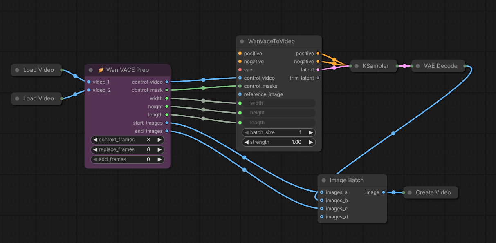

# Wan VACE Prep

A ComfyUI node that generates a VACE control video and mask for a smooth transition between two videos. 

## What It Does

Takes two video clips and prepares them for smooth VACE-based transition
- Extracts context frames from both clips
- Builds VACE control video and mask
- Output video segments for final assembly
- Optionally include context frames in output segments for crossfade or other artifact-reduction processing

## Installation
### ComfyUI Manager
Search for "**Wan VACE Prep**" in ComfyUI Manager and click *Install*.

### Clone this repository into your custom_nodes directory.
```bash
    cd /path/to/comfyui/custom_nodes
    git clone https://github.com/stuttlepress/ComfyUI-Wan-VACE-Prep
```
Restart ComfyUI.

## Usage

The node appears as **"Wan VACE Prep"** in the `video/VACE` category.



## Parameters 

### context_frames
Reference frames from each video edge that VACE uses for interpolation. These frames guide the model and are preserved in the output. Must be a multiple of 4.

### replace_frames
Number of frames at each transition edge to discard and regenerate. These create the actual transition blend zone. Must be a multiple of 4.

### add_frames
Number of completely new frames to generate between the two clips, extending the transition duration. Must be a multiple of 4.

Note: Wan likes to generate 4n+1 frames at a time. If you ask it for some other amount, it will silently round your request down to the nearest 4n+1. For this reason, parameters are restricted to multiples of 4, and the node adds +1 to the number of generated frames. 

### crossfade_mode
- **False (default)**: Clean output - start_images and end_images exclude context frames. Use this for simple concatenation.
- **True**: Cross-fade mode - includes context frames in start_images and end_images so they can be blended with the context frames included in the VACE generated clip. This can help mitigate color or brightness artifacts at the transition.

## License

MIT License - feel free to use, modify, and distribute.
