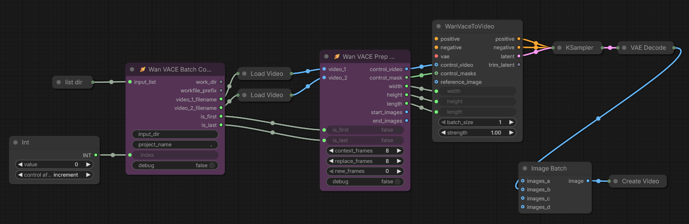
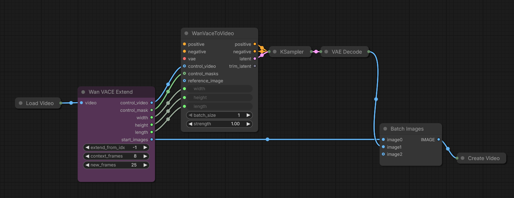

# Wan VACE Prep

ComfyUI nodes for Wan VACE workflows. Control video and mask creation for transitions and extensions, plus workflow utilites.

## Quick Start
**Install via ComfyUI Manager:** Search for "Wan VACE Prep"

**Or clone this repository:**
```bash
cd /path/to/comfyui/custom_nodes
git clone https://github.com/stuttlepress/ComfyUI-Wan-VACE-Prep
```

## Nodes

### Wan VACE Prep
For smoothly joining two video clips together. Builds VACE controls for the transition using context frames from each clip to guide frame generation. 

- Builds VACE control video and mask from context frames in both clips
- Outputs video segments for final assembly


**Parameters:**
|Parameter|Default|Description|
|-|-|-|
|context_frames|8|Reference frames from each video edge that VACE uses for interpolation. These frames guide the model and are preserved in the output. Must be a multiple of 4.|
|replace_frames|8|Number of frames at each transition edge to discard and regenerate. These create the actual transition blend zone. Must be a multiple of 4.|
|add_frames|0|Number of completely new frames to generate between the two clips, extending the transition duration. Must be 0 or a multiple of 4.|


**Outputs:**
|Output|Description|
|-|-|
|control_video|VACE control video input|
|control_mask|VACE control mask input|
|width, height, length|Control video dimensions|
|start_images|Video 1 segment that precedes context frames and the transition|
|end_images|Video 2 segment that comes after the transition and context frames|

---

### Wan VACE Prep Batch
Batch-aware version of Wan VACE Prep for processing multiple video pairs. Handles first/last iteration edge cases.



**Parameters:**
|Parameter|Default|Description|
|-|-|-|
|video_1| |First video in the pair (IMAGE type)|
|video_2| |Second video in the pair (IMAGE type)|
|is_first|false|Set true for first iteration (index=0) - includes full beginning of video_1 in start_images|
|is_last|false|Set true for last iteration - includes full ending of video_2 in end_images|
|context_frames|8|Reference frames from each video edge that VACE uses for interpolation. These frames guide the model and are preserved in the output. Must be a multiple of 4.|
|replace_frames|8|Number of frames at each transition edge to discard and regenerate. These create the actual transition blend zone. Must be a multiple of 4.|
|new_frames|0|Number of completely new frames to generate between the two clips, extending the transition duration. Must be 0 or a multiple of 4.|
|debug|false|Log diagnostic information to the console|

**Outputs:**
|Output|Description|
|-|-|
|control_video|VACE control video input (context frames + placeholder for generation)|
|control_mask|VACE control mask input (masks generation region)|
|width, height, length|Control video dimensions|
|start_images|Video segment from video_1 to preserve (excludes transition region)|
|end_images|Video segment from video_2 to preserve (only populated on last iteration)|

---

### Wan VACE Batch Context
Establishes iteration context for batch video processing workflows. Manages file paths, iteration tracking, and provides first/last flags for proper handling of video sequence boundaries.


**Parameters:**
|Parameter|Default|Description|
|-|-|-|
|input_list| |List of video filenames to process (STRING, force input)|
|input_dir| |Directory containing input videos|
|project_name|.|Project name - workflow files created under ComfyUI/output/project_name. Use period (.) for no project name.|
|index|0|Current iteration index (0-based). Valid range: 0 to (number of videos - 2)|
|debug|false|Log iteration details to the console|

**Outputs:**
|Output|Description|
|-|-|
|work_dir|Working directory path for intermediate files|
|workfile_prefix|Filename prefix for this iteration's work files|
|is_first|True if this is the first iteration (index=0)|
|is_last|True if this is the last iteration|
|video_1_filename|Full path to first video in current pair|
|video_2_filename|Full path to second video in current pair|

--

### Wan VACE Extend
For smoothly extending a video. Context frames from before the chosen extension point are used to build a control video for VACE conditioning. 

- Extends from arbitrary frame position
- Builds VACE control video and mask from context frames in the input video
- Outputs video segment preceding the extension for video reassembly




**Parameters:**

| Parameter | Default | Description |
|-|-|-|
| extend_from_idx | -1 | Frame to extend from (negative counts from end, e.g., -1 = last frame) |
| context_frames | 8 | Number of reference frames preceding extend_from_idx that VACE uses for interpolation. These frames guide the model and are preserved in the output. Must be a multiple of 4. |
| new_frames | 25 | Number of new frames to generate (must be 4n+1: e.g., 1, 5, 9, 13, 17, 25...) |

**Outputs:**
|Output|Description|
|-|-|
|control_video|VACE control video input|
|control_mask|VACE control mask input|
|width, height, length|Control video dimensions|
|start_images|Video segment that precedes the context frames and the start of the extension|

---

### Load Videos From Folder (Simple)
Load all videos from a folder for batch processing. A simplified, dependency-free alternative to KJNodes' LoadVideosFromFolder (which depends on VideoHelperSuite and can have problems in some environments).

- **Formats:** webm, mp4, mkv, gif, mov
- All videos must have identical resolution
- No external dependencies	
	
	
	


**Parameters:**

| Parameter | Default | Description |
|-|-|-|
| folder_path |  | Full pathname of the directory holding input videos. |
|debug|false|Log video details and progress to the console|


**Outputs:**
|Output|Description|
|-|-|
| images | Concatenated image batch ready for video creation. |

---
## Technical Note
The Wan model likes to generate 4n+1 frames at a time. If you ask it for some other amount, it will silently round your request down to the nearest 4n+1. For this reason, parameters are restricted to multiples of 4 or 4n+1 and when necessary, the node adds +1 to the number of generated frames. 

## License
MIT License - feel free to use, modify, and distribute.