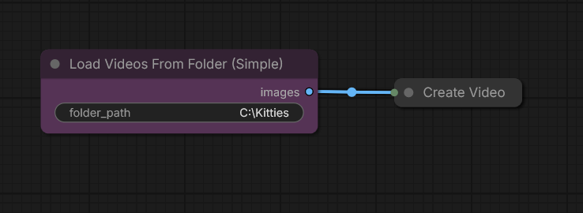

# Wan VACE Prep

A small collection of ComfyUI nodes for common video tasks. Primarily designed for Wan VACE, with LTX-2 outpainting support.

**Note:** As of v1.1.0, all code has been migrated to ComfyUI's Nodes 2.0 (V3) API. Nodes are still 100% compatible with the legacy ComfyUI renderer. There should be no noticeable changes in behavior, but please [report any problems](https://github.com/stuttlepress/ComfyUI-Wan-VACE-Prep/issues) you encounter. `v1.0.25` is the last legacy (pre-V3) release.

## Quick Start

**Install via ComfyUI Manager:** Search for "Wan VACE Prep"

**Or clone this repository:**

```bash
cd /path/to/comfyui/custom_nodes
git clone https://github.com/stuttlepress/ComfyUI-Wan-VACE-Prep
```

## Nodes

- [Video Outpaint](#video-outpaint) *(formerly VACE Outpaint)*
- [VACE Join](#vace-join)
- [VACE Join (Batch)](#vace-join-batch)
- [VACE Batch Context](#vace-batch-context)
- [VACE Extend](#vace-extend)
- [Load Videos From Folder (Simple)](#load-videos-from-folder-simple)
- [MiniMax H3 Duration](#minimax-h3-duration)
- [Int (Constrained)](#int-constrained)

**Experimental:**

- [VACE Inpaint](#vace-inpaint)
- [Frame Number Overlay](#frame-number-overlay)
- [Wan First/Middle/Last Frame to Video](#wan-firstmiddlelast-frame-to-video)
- [VACE First/Middle/Last](#vace-firstmiddlelast)

### Video Outpaint

Prepares a video for outpainting using an interactive canvas widget. Position and size an output window over your source frames. Regions outside the source become the outpaint area. A model selector targets Wan VACE, LTX-2, or MiniMax H3: each sets its own quantisation grid and pad color.

Renamed from *VACE Outpaint*.


**Parameters:**

| Parameter | Default | Description |
|-|-|-|
| images | | Source video frames |

**Canvas controls:**

| Control | Description |
|-|-|
| output resolution | Width and height of the generated output. Leave at 0 to match the crop box size. |
| model | Consumer model. Sets the quantisation grid **and** the pad color together: `wan` = 16px grid, gray (0.5); `ltx` = 32px grid, black (0.0); `h3` = 32px grid, gray (0.5). Changing it re-snaps the crop box and output resolution onto the new grid. |
| pad | `model default` uses the pad color above; `custom` enables the color field: a hex code (#RRGGBB), 0-255 integers (R,G,B), or 0.0-1.0 floats (R,G,B). |
| grid | Grid override in output pixels. Leave blank (0) to use the model's grid. |

**Why the grid matters.** A model's mask cell is its VAE spatial compression times the transformer's patch size: 16 for Wan (8x VAE, 2x2 patch), 32 for LTX-2 (32x VAE, 1x1 patch) and MiniMax H3 (16x VAE, 2x2 patch). A mask boundary that is not a multiple of that cell lands mid-cell, and the consumer must either freeze it (pad color is encoded as clean content, drawing a frame around the kept region) or regenerate it (up to grid-1 px of real footage replaced, which reads as edge blur). Both output paths here emit the kept rect on the grid, so every cell is purely content or purely pad.

**Upgrading from an older version.** The `pad color` widget became `model` in the same slot, so saved workflows load without edits: `wan` and `ltx` map straight across, and a custom pad color becomes `wan` + `pad: custom`, which is what it did before. Saved `ltx` workflows do change behavior - their grid goes from 16 to 32, re-snapping the layout. That was the bug; the node logs the snap when it happens.

**Outputs:**

| Output | Description |
|-|-|
| control_video | VACE control video input. Source content placed within the output window; overhanging regions filled with the selected pad color. |
| control_mask | VACE control mask input. White (1) where outpainting should occur, black (0) over source content. |
| width, height | Output video dimensions |
| length | Frame count |

https://github.com/user-attachments/assets/a233832a-6630-4e7b-8d05-9e048d2e97a4

**This node may be fragile under Nodes 2.0 / V3.** ComfyUI has not documented any method for building a dynamic UI like this canvas widget, so its behavior had to be reverse-engineered from the source and the minified frontend bundle. These are the most likely things to break across ComfyUI releases:

- **Video Outpaint canvas sizing** (`web/vace_outpaint.js`). The DOM-widget sizing contract (`getMinHeight` feeding `DOMWidgetImpl.computeLayoutSize`, framework-driven height, flex-column fill) is not documented. There is also no supported way to set a minimum node *width* for a DOM widget, so the controls are contained with CSS instead of a hard floor.
- **Video Outpaint scroll-to-zoom** (`web/vace_outpaint.js`). Nodes 2.0 hijacks mouse wheel events over the node, preventing scroll-to-zoom in the editor. The editor opts out via the undocumented `data-capture-wheel="true"` contract (in use by some native ComfyUI widgets), which defers only while the marked element contains `document.activeElement`; the canvas is focused on hover to satisfy that. If ComfyUI changes the attribute or the focus check, plain scroll would zoom the graph instead of the crop preview.

ComfyUI ships essentially no reference for the V3 `io.*` type catalog or these widget/execution contracts; the only authoritative source is the (underscore-private) `comfy_api/latest/_io.py` and the compiled frontend.

---

### VACE Join	
For smoothly joining two video clips together. Builds VACE controls for the transition using context frames from each clip to guide frame generation. 


**Parameters:**

| Parameter | Default | Description |
|-|-|-|
| video_1 | | First video in the pair (IMAGE type) |
| video_2 | | Second video in the pair (IMAGE type) |
| context_frames | 8 | Reference frames from each video edge that VACE uses for interpolation. These frames guide the model and are preserved in the output. Must be a multiple of 4. |
| replace_frames | 8 | Number of frames at each transition edge to discard and regenerate. These create the actual transition blend zone. Must be a multiple of 4. |
| new_frames | 0 | Number of completely new frames to generate between the two clips, extending the transition duration. Must be 0 or a multiple of 4. |

**Outputs:**

| Output | Description |
|-|-|
| control_video | VACE control video input |
| control_mask | VACE control mask input |
| width, height, length | Control video dimensions |
| start_images | Video 1 segment that precedes context frames and the transition |
| end_images | Video 2 segment that comes after the transition and context frames |
| context_frames, replace_frames, new_frames | Parameter passthrough for optional downstream wiring |


https://github.com/user-attachments/assets/5b70b5af-8d88-4c0f-a5a7-cdbe0657ce8c


---

### VACE Join (Batch)

Batch-aware version of VACE Join for processing multiple video pairs. Handles first/last iteration edge cases.


**Parameters:**

| Parameter | Default | Description |
|-|-|-|
| video_1 | | First video in the pair (IMAGE type) |
| video_2 | | Second video in the pair (IMAGE type) |
| is_first | false | Set true for first iteration (index=0). Includes full beginning of video_1 in start_images |
| is_last | false | Set true for last iteration. Includes full ending of video_2 in end_images |
| context_frames | 8 | Reference frames from each video edge for VACE interpolation. Must be a multiple of 4. |
| replace_frames | 8 | Frames at each transition edge to discard and regenerate. Must be a multiple of 4. |
| new_frames | 0 | New frames to generate between clips. Must be 0 or a multiple of 4. |
| debug | false | Log diagnostic information to the console |

**Outputs:**

| Output | Description |
|-|-|
| control_video | VACE control video input (context frames + placeholder for generation) |
| control_mask | VACE control mask input (masks generation region) |
| width, height, length | Control video dimensions |
| start_images | Video segment from video_1 to preserve (excludes transition region) |
| end_images | Video segment from video_2 to preserve (only populated on last iteration) |
| context_frames, replace_frames, new_frames | Parameter passthrough for optional downstream wiring |

---

### VACE Batch Context

*This node drives my [Wan VACE Video Joiner](https://github.com/stuttlepress/ComfyUI-Wan-VACE-Video-Joiner) workflow. It may not be useful outside of that context.*  
Establishes iteration context for batch video processing workflows. Manages file paths, iteration tracking, and provides first/last flags for proper handling of video sequence boundaries. Supports an optional loop mode that generates a wrap-around transition between the last and first video for seamless looping output.


**Parameters:**

| Parameter | Default | Description |
|-|-|-|
| input_list | | List of video filenames to process (STRING, force input) |
| input_dir | | Directory containing input videos |
| project_name | | Workflow files are created under ComfyUI/output/project_name. Leave blank for no project name. |
| index | 0 | Current iteration index (0-based). Valid range: 0 to (number of videos - 2) normally, or 0 to (number of videos - 1) when `make_loop=true` |
| debug | false | Log iteration details to the console |
| make_loop | false | Enable loop mode. Adds one extra iteration that pairs the last video with the first, creating a seamless loop. When true, `is_first` and `is_last` are always false. |

**Outputs:**

| Output | Description |
|-|-|
| work_dir | Working directory path for intermediate files |
| workfile_prefix | Filename prefix for this iteration's work files |
| video_1_filename | Full path to first video in current pair |
| video_2_filename | Full path to second video in current pair |
| is_first | True if this is the first iteration (index=0). Always false when `make_loop=true`. |
| is_last | True if this is the last iteration. Always false when `make_loop=true`. |
| assemble_video | True on the final iteration. Used to gate the assembly step. Equivalent to `is_last` when `make_loop=false`; fires on the loop-closing iteration when `make_loop=true`. |

**This node may be fragile under Nodes 2.0 / V3.** It relies on the `is_input_list` calling convention (every input delivered as a list rather than a single value) to drive the batch iteration logic, and this calling convention's semantics are not spelled out in the V3 docs. ComfyUI ships essentially no reference for these execution contracts; the only authoritative source is the (underscore-private) `comfy_api/latest/_io.py` and the compiled frontend.

---

### VACE Extend

Extends a video from an arbitrary frame position. Context frames preceding the extension point build a VACE control video for conditioning.


**Parameters:**

| Parameter | Default | Description |
|-|-|-|
| video | | Source video frames (IMAGE type) |
| extend_from_idx | -1 | Frame to extend from (negative counts from end, e.g., -1 = last frame) |
| context_frames | 8 | Reference frames preceding extend_from_idx for VACE conditioning. Must be a multiple of 4. |
| new_frames | 25 | Number of new frames to generate (must be 4n+1: 1, 5, 9, 13, 17, 21, 25...) |

**Outputs:**

| Output | Description |
|-|-|
| control_video | VACE control video input |
| control_mask | VACE control mask input |
| width, height, length | Control video dimensions |
| start_images | Video segment that precedes the context frames and the extension |
| context_frames, new_frames | Parameter passthrough for downstream wiring |

---

### Load Videos From Folder (Simple)

Loads all videos from a folder, concatenated into a single image batch with their audio tracks combined.

Optionally connect a **[VideoHelperSuite](https://github.com/Kosinkadink/ComfyUI-VideoHelperSuite)** *Meta Batch Manager* node to process large collections in RAM-safe chunks. If you are joining a large number of video files and running out of system memory as they concatenate, this is the solution. From the VHS Meta Batch Manager node documentation:

> The Meta Batch Manager allows for extremely long input videos to be processed when all other methods for fitting the content in RAM fail. It does not affect VRAM usage. It must be connected to at least one Input (a Load Video or Load Images) AND at least one Video Combine.

See the VHS Meta Batch Manager node documentation for more information.

*Meta Batch Manager* rule of thumb: set `frames_per_batch` to roughly 10× your available RAM (not VRAM) in GB. So 32 GB -> 320 frames, 64 GB -> 640 frames, 128 GB -> 1280 frames.

- **Formats:** webm, mp4, mkv, gif, mov
- All videos must have identical resolution
- No external dependencies



**Parameters:**

| Parameter | Default | Description |
|-|-|-|
| folder_path | | Full pathname of the directory holding input videos |
| debug | false | Log video details and progress to the console |
| meta_batch | *(optional)* | Connect to VideoHelperSuite Meta Batch Manager to load videos in batches |

**Outputs:**

| Output | Description |
|-|-|
| images | Concatenated image batch ready for video creation |
| audio | Combined audio track from all loaded videos. Disabled (empty) if any video lacks audio. |

**This node may be fragile under Nodes 2.0 / V3.** The optional `meta_batch` input uses `io.Custom("VHS_BatchManager")` to accept a VideoHelperSuite Meta Batch Manager connection, and this custom-socket-type pattern is undocumented. ComfyUI ships essentially no reference for the V3 `io.*` type catalog; the only authoritative source is the (underscore-private) `comfy_api/latest/_io.py` and the compiled frontend.

---

### MiniMax H3 Duration

Converts a requested duration in seconds to a MiniMax H3-compatible frame count and the resulting revised duration. MiniMax H3 requires frame counts of the form `17k+5` at a fixed 24 fps; this node rounds up to the nearest valid frame count and reports the actual (revised) duration that results.


**Parameters:**

| Parameter | Default | Description |
|-|-|-|
| seconds | 6.0 | Requested duration in seconds |

**Outputs:**

| Output | Description |
|-|-|
| frames | Frame count, rounded up to the nearest `17k+5` at 24 fps |
| revised_seconds | Actual duration in seconds that `frames` produces at 24 fps |

### Int (Constrained)

An Int primitive with per-node min, max and step constraints. Values you type, drag or step to are snapped to the nearest step inside [min, max], and the backend applies the same snap at execution.

The constraints are hidden on the node. With Nodes 2.0 they are advanced inputs: open the properties panel and use **Show advanced inputs**, or pick **Show Advanced** from the node menu. On the legacy canvas they live in the node's **Properties Panel** (right-click the node) as `min`, `max` and `step`; leave `min` or `max` empty for no limit.

**Parameters:**

| Parameter | Default | Description |
|-|-|-|
| value | 0 | The integer value |
| min *(advanced)* | unset | Lowest allowed value. When set, the step grid counts from here |
| max *(advanced)* | unset | Highest allowed value |
| step *(advanced)* | 1 | Values snap to the nearest multiple of step, counted from min (or from 0 when min is unset). 1 means no snapping |

**Outputs:**

| Output | Description |
|-|-|
| INT | The snapped value |

**Notes:**

- In Nodes 2.0, an unset `min` or `max` shows as `-9007199254740991` or `9007199254740991` (the largest integer the browser can hold exactly). Setting either field to that number clears the limit.
- A value exactly halfway between two steps snaps up.
- If `min` is greater than `max`, or no step falls between them, the node does not change the value and the workflow fails at execution with an error naming the problem.
- The value shown on the node may be off by a step from the output when `min`, `max` or the value is near +-9 quadrillion (2^53). The output is always computed exactly.

---
## Experimental

Stuff here is new and has not been thoroughly tested. Inputs, outputs, and behavior may change in future releases without notice.

### VACE Inpaint

Prepares control video and mask for inpainting. Connect the output to `WanVaceToVideo.control_video` / `control_masks`; use `WanVaceToVideo.reference_image` separately if you need a reference frame.

**Parameters:**

| Parameter | Default | Description |
|-|-|-|
| video | | Source video frames (IMAGE) |
| mask | | Inpaint mask. White (1) marks regions to regenerate, black (0) preserves the original. Can be a single frame (broadcast to all frames) or a per-frame sequence. |

**Outputs:**

| Output | Description |
|-|-|
| control_video | VACE control video input. Masked pixels replaced with gray (0.5). |
| control_mask | VACE control mask input. White (1) where inpainting should occur, black (0) over preserved content. |
| width, height | Video dimensions (must be divisible by 16) |
| length | Frame count (matches input video) |

---

### Frame Number Overlay

Burns a frame number label into every frame of an IMAGE batch as a text overlay. Useful for identifying frames in long sequences or debugging video workflows.

**Parameters:**

| Parameter | Default | Description |
|-|-|-|
| images | | Input image batch (IMAGE) |
| font_size | 32 | Size of the overlay text (8–256) |
| start_index | 0 | Starting frame number for the first frame in the batch |
| position | top-left | Placement: top-left, top-right, bottom-left, or bottom-right |
| padding | 10 | Distance from edge in pixels |
| font_color | white | Text color (any CSS color name or hex) |
| prefix | "" | Optional text before the frame number |
| suffix | "" | Optional text after the frame number |

**Outputs:**

| Output | Description |
|-|-|
| images | Image batch with frame numbers burned in |

---

### Wan First/Middle/Last Frame to Video

Based on native ComfyUI WanFirstLastFrameToVideo, generates conditioning latents from optional start, end, and middle reference images using a VAE and clip vision model. 

**Parameters:**

| Parameter | Default | Description |
|-|-|-|
| positive | | Positive conditioning |
| negative | | Negative conditioning |
| vae | | VAE for latent encoding/decoding |
| width | 832 | Output width (multiple of 16) |
| height | 480 | Output height (multiple of 16) |
| length | 81 | Frame count (4n+1 pattern) |
| batch_size | 1 | Number of parallel generations |
| start_image | *(optional)* | Reference image for the beginning frames |
| middle_image | *(optional)* | Reference image for middle frames |
| middle_frame | 0.5 | Position of middle reference as fraction of total length |
| end_image | *(optional)* | Reference image for the ending frames |
| clip_vision_start_image | *(optional)* | CLIP vision output for start image guidance |
| clip_vision_middle_image | *(optional)* | CLIP vision output for middle image guidance |
| clip_vision_end_image | *(optional)* | CLIP vision output for end image guidance |

**Outputs:**

| Output | Description |
|-|-|
| positive | Positive conditioning with frame-level guidance |
| negative | Negative conditioning |
| latent | Generated latent video tensor |

---

### VACE First/Middle/Last

Builds a VACE control video and mask from optional first, middle, and last frame batches. Known frames are placed at their positions with mask=0; remaining frames become gray placeholders (mask=1) for Wan to generate. I have found VACE FLF2V and FMLF2V to be far less effective than conditioning-based versions. VACE-generated motion tends to be very linear, unnatural when applied to people, except for very short sequences.

**Parameters:**

| Parameter | Default | Description |
|-|-|-|
| width | 832 | Output width (snapped to 16px grid if needed) |
| height | 480 | Output height (snapped to 16px grid if needed) |
| length | 81 | Total frame count (must follow 4n+1 pattern; snapped if not) |
| middle_position | 0.5 | Where middle frames are centered as a fraction of total length |
| first | *(optional)* | Reference frames for the beginning |
| middle | *(optional)* | Reference frames for the middle region |
| last | *(optional)* | Reference frames for the ending |

**Outputs:**

| Output | Description |
|-|-|
| control_video | VACE control video (known frames + gray placeholders) |
| control_mask | VACE control mask (0 over known regions, 1 over generation zones) |
| width, height, length | Final snapped dimensions and frame count |

---

## Technical Notes

**4n+1 frame rule.** The Wan model generates 4n+1 frames at a time. If you request a different count, it silently rounds down to the nearest 4n+1. For this reason, parameters are restricted to multiples of 4 or 4n+1, and when necessary the nodes add +1 to the generated frame count.

**Class names vs. display names.** Some internal class names (e.g., `WanVACEPrep`) don't match the current display names (e.g., "VACE Join"). This is intentional: renaming classes would break existing workflows that reference them. Once ComfyUI's node renaming API is stable, a refactoring pass will align them.

---

## License

MIT License. Feel free to use, modify, and distribute.
